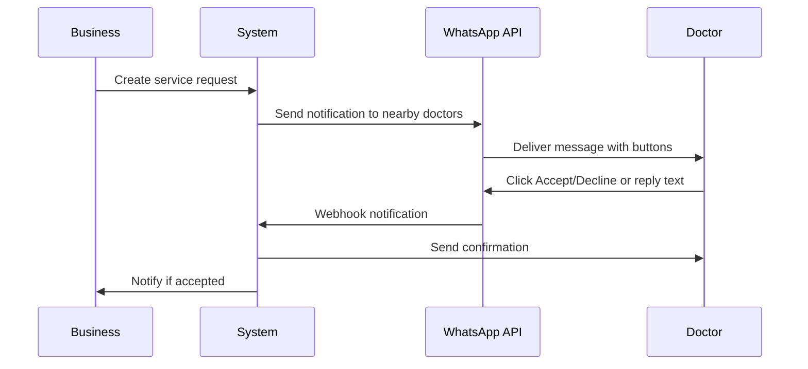

# WhatsApp Business API Integration Setup Guide

This guide will help you set up WhatsApp Business API notifications for service requests in the ThanksDoc platform.

## Overview

The WhatsApp Business API integration allows doctors to receive and respond to service requests directly through WhatsApp messages. This implementation uses Facebook's official WhatsApp Business API, which is more cost-effective than third-party services like Twilio.

## Benefits of WhatsApp Business API

### Cost Advantages:
- **Free tier**: 1,000 conversations per month
- **Lower costs**: ~$0.005-0.05 per conversation vs Twilio's ~$0.05-0.10 per message
- **Conversation-based pricing**: Multiple messages in 24 hours = 1 conversation
- **No setup fees**: Direct integration with Facebook

### Features:
- ✅ **Official WhatsApp integration**
- ✅ **Message templates** for faster delivery
- ✅ **Rich media support** (images, documents, buttons)
- ✅ **Webhook support** for real-time message handling
- ✅ **Business verification** for trusted messaging

## Prerequisites

1. **Facebook Business Account** - Required for WhatsApp Business API
2. **WhatsApp Business Account** - Must be verified
3. **Phone Number** - Dedicated business phone number
4. **Business Verification** - Complete Facebook business verification

## Setup Steps

### 1. Create Facebook Business Account

1. Go to [Facebook Business](https://business.facebook.com/)
2. Create a business account
3. Complete business verification process
4. Add your business phone number

### 2. Set Up WhatsApp Business API

1. Go to [Facebook Developers](https://developers.facebook.com/)
2. Create a new app → Business → WhatsApp
3. Add WhatsApp Business API product
4. Complete the setup wizard

### 3. Get Required Credentials

From your Facebook App Dashboard, collect:

```bash
# Required credentials
WHATSAPP_ACCESS_TOKEN=EAAxxxxxxxxxx  # Permanent access token
WHATSAPP_PHONE_NUMBER_ID=123456789  # Your business phone number ID
WHATSAPP_BUSINESS_ACCOUNT_ID=987654321  # Business account ID
WHATSAPP_WEBHOOK_VERIFY_TOKEN=your_custom_verify_token  # Custom token for webhook verification
```

### 4. Configure Environment Variables

Add these to your `.env` file:

```bash
# WhatsApp Business API Configuration
WHATSAPP_ACCESS_TOKEN=your_permanent_access_token
WHATSAPP_PHONE_NUMBER_ID=your_phone_number_id
WHATSAPP_BUSINESS_ACCOUNT_ID=your_business_account_id
WHATSAPP_WEBHOOK_VERIFY_TOKEN=your_webhook_verify_token

# WhatsApp Template (optional)
WHATSAPP_USE_TEMPLATE=false
WHATSAPP_TEMPLATE_NAME=service_request_notification

# Base URL
BASE_URL=https://your-production-domain.com
```

### 5. Set Up Webhook

1. In Facebook App Dashboard → WhatsApp → Configuration
2. Add webhook URL: `https://your-domain.com/api/service-requests/whatsapp-webhook`
3. Use your `WHATSAPP_WEBHOOK_VERIFY_TOKEN` for verification
4. Subscribe to `messages` events

For local development, use ngrok:
```bash
ngrok http 1337
# Use the https URL for webhook
```

## Message Templates (Optional)

For faster delivery and lower costs, create approved message templates:

### 1. Create Template in Facebook Business Manager

Template Name: `service_request_notification`

Template Content:
```
🏥 NEW SERVICE REQUEST

{{1}} needs a {{2}} at {{3}}
Duration: {{4}} hour(s)

Details: {{5}}

Quick Actions:
[Accept] [Decline]
```

### 2. Enable Template in Environment

```bash
WHATSAPP_USE_TEMPLATE=true
WHATSAPP_TEMPLATE_NAME=service_request_notification
```

## How It Works

### 1. Service Request Flow



### 2. Message Types

**Template Message** (faster delivery):
- Uses approved templates
- Can include interactive buttons
- Lower latency and cost

**Text Message** (fallback):
- Plain text with links
- Works without template approval
- Standard conversation pricing

### 3. Doctor Response Options

**Option A: Interactive Buttons** (with templates)
- Tap "Accept" or "Decline" buttons
- Immediate response processing

**Option B: Click Links**
- Click URLs in message
- Opens web confirmation page

**Option C: Text Replies**
- Reply "ACCEPT" or "DECLINE"
- Processed by webhook

## Testing

### 1. Webhook Verification

Test webhook setup:
```bash
curl -X GET "https://your-domain.com/api/service-requests/whatsapp-webhook?hub.mode=subscribe&hub.verify_token=your_verify_token&hub.challenge=test"
```

### 2. Send Test Message

Use the test interface:
```bash
# Open test page
http://localhost:1337/test-whatsapp.html

# Or use API directly
POST /api/service-requests/test-whatsapp
{
  "doctorId": "doctor_id",
  "testMessage": "Test message"
}
```

### 3. Test Message Flow

1. Create test service request
2. Verify doctors receive WhatsApp messages
3. Test Accept/Decline responses
4. Check webhook processing

## Cost Optimization

### 1. Conversation Management
- **24-hour window**: Multiple messages = 1 conversation
- **Template messages**: Lower cost than session messages
- **Business-initiated**: Use templates for notifications

### 2. Template Strategy
```javascript
// Use templates for initial notifications (business-initiated)
const useTemplate = process.env.WHATSAPP_USE_TEMPLATE === 'true';

// Use text messages for confirmations (user-initiated conversation)
const confirmationMessage = { type: "text", text: { body: "..." } };
```

### 3. Rate Limiting
- **Messaging limits**: 250 messages/second
- **Conversation limits**: Based on phone number tier
- **Implementation**: Add rate limiting for high-volume scenarios

## Monitoring & Analytics

### 1. Facebook Analytics
- Message delivery rates
- Conversation costs
- User engagement metrics

### 2. Application Logs
```javascript
// Monitor these metrics
- Message send success/failure rates
- Webhook processing times
- Doctor response rates
- Template vs text message usage
```

### 3. Error Handling
```javascript
// Common error scenarios
- Invalid phone numbers
- Rate limit exceeded
- Template not approved
- Webhook delivery failures
```

## Production Deployment

### 1. Business Verification
- Complete Facebook business verification
- Verify WhatsApp Business Account
- Get production access approved

### 2. Phone Number Setup
- Use dedicated business phone number
- Complete phone number verification
- Set up display name and profile

### 3. Scaling Considerations
- **Tier limits**: Start with 250 conversations/day
- **Request increases**: Apply for higher limits
- **Multiple numbers**: Use different numbers for different regions

### 4. Security
- **Webhook validation**: Always verify webhook signatures
- **Token security**: Use environment variables
- **HTTPS only**: Secure webhook endpoints

## Troubleshooting

### Common Issues

**Messages not delivered:**
- Check phone number format (no + prefix for API)
- Verify access token validity
- Check rate limits and quotas

**Webhook not working:**
- Verify webhook URL accessibility
- Check verify token configuration
- Monitor webhook logs

**Template not working:**
- Ensure template is approved
- Check parameter count and format
- Verify template name spelling

### Debug Tools

**Facebook Graph API Explorer:**
- Test API calls directly
- Verify credentials and permissions

**Webhook Testing:**
- Use ngrok for local development
- Check webhook delivery in Facebook dashboard

**Message Status:**
- Monitor message status in Graph API
- Check delivery receipts

## Next Steps

1. **Complete Facebook business verification**
2. **Set up WhatsApp Business API app**
3. **Configure webhook and test locally**
4. **Create and submit message templates**
5. **Deploy to production with verified credentials**
6. **Monitor usage and optimize costs**

## Cost Comparison

| Provider | Setup | Per Message | Per 1000 Messages | Features |
|----------|--------|-------------|-------------------|----------|
| WhatsApp Business API | Free | $0.005-0.05 | $5-50 | Official, Templates, Rich Media |
| Twilio | Free | $0.05-0.10 | $50-100 | Third-party, Easy setup |
| Direct Integration | Development Time | $0.005-0.05 | $5-50 | Full control, Most cost-effective |

## Support Resources

- [WhatsApp Business API Documentation](https://developers.facebook.com/docs/whatsapp)
- [Facebook Business Help Center](https://www.facebook.com/business/help)
- [Graph API Reference](https://developers.facebook.com/docs/graph-api)
- [Webhook Setup Guide](https://developers.facebook.com/docs/graph-api/webhooks)
